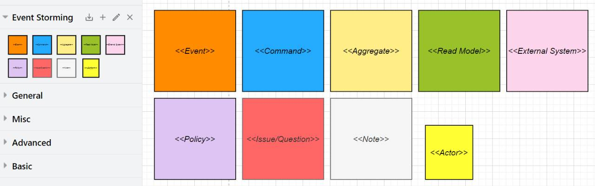

# Library of shapes for Event Storming in draw.io

## Usage

Follow the link to start using the function figure: [https://app.diagrams.net/?clibs=Uhttps://raw.githubusercontent.com/chakuryk/drawio-event-storming/master/Event Storming.xml](https://app.diagrams.net/?clibs=Uhttps%3A%2F%2Fraw.githubusercontent.com%2Fchakuryk%2Fdrawio-event-storming%2Fmaster%2FEvent%20Storming.xml){:target="_blank"}
